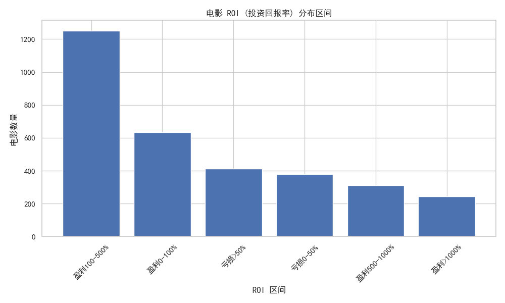
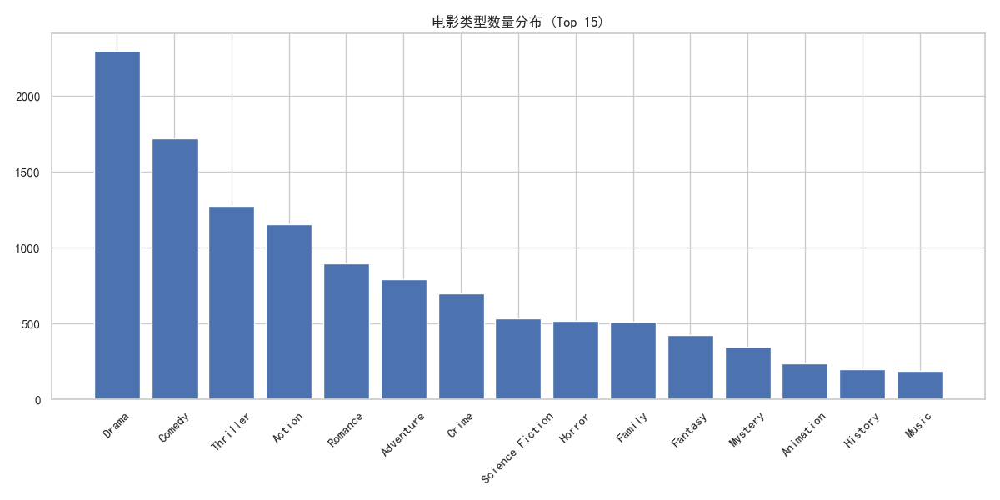
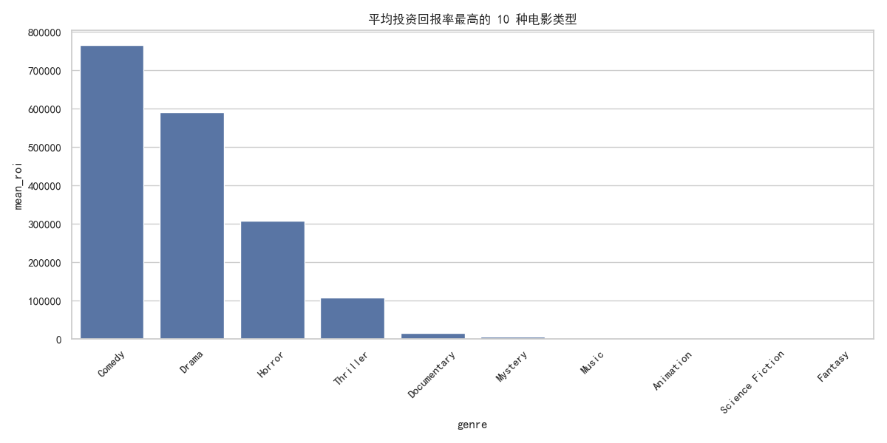
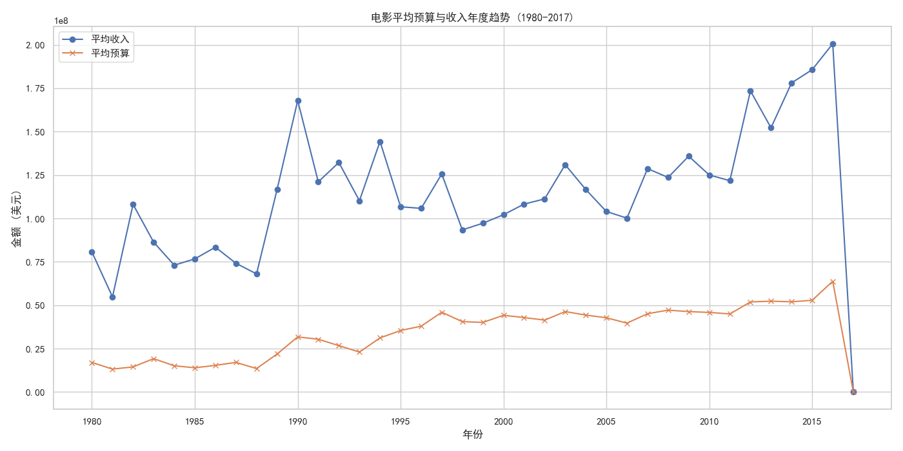
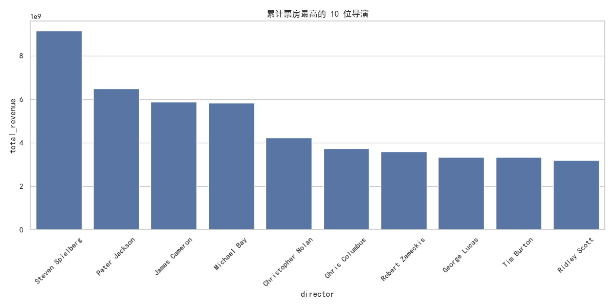

# 影视数据分析报告：基于 TMDB 5000 数据集

**日期**: 2025年12月29日  
**数据来源**: TMDB 5000 Movie Dataset  
**分析工具**: Python (Pandas, Matplotlib, Seaborn)

---

## 1. 引言

本报告旨在通过深入分析 TMDB 5000 电影数据集，揭示电影产业的财务规律、受众偏好及市场趋势。我们重点关注投资回报率 (ROI)、电影类型的市场表现、历史发展趋势以及核心创作人员（导演）的商业价值，为影视投资和制作提供数据支持。

---

## 2. 投资回报率 (ROI) 分析

投资回报率是衡量电影商业成功与否的关键指标。

### 2.1 总体统计与分布

*   **盈利情况**: 在有完整财务数据的电影中，**75.5%** (2438部) 实现了盈利，而 **24.5%** (791部) 处于亏损状态。
*   **回报率区间**: 大部分盈利电影的 ROI 集中在 **100% - 500%** 之间。这意味着一部成功的商业电影，其票房收入通常是成本的 2 到 6 倍。
*   **中位数 ROI**: **130%**。这是一个更具代表性的数字，表明一部典型的盈利电影，其净利润略高于成本。

*(图 1: 电影 ROI 分布区间统计)*

### 2.2 极端案例分析

*   **高回报案例**: 
    *   *《摩登时代》(Modern Times)* 拥有惊人的 ROI，这与其极低的记录成本和长尾收益有关。
    *   现代高回报代表如 *《灵动：鬼影实录》(Paranormal Activity)* (ROI > 1,000,000%) 和 *《女巫布莱尔》(The Blair Witch Project)* (ROI > 400,000%)，证明了**低成本恐怖片**具有以小博大的巨大潜力。
*   **低回报案例**:
    *   部分电影如 *《Chasing Liberty》* 和 *《The Cookout》* 票房极其惨淡，ROI 接近 -100%，基本血本无归。

---

## 3. 电影类型 (Genre) 市场表现

不同类型的电影在预算规模和回报潜力上存在显著差异。

### 3.1 类型数量与热度

**喜剧 (Comedy)** 和 **剧情 (Drama)** 是产量最高的类型，分别有 1110 部和 1441 部。这反映了这两类电影相对较低的制作门槛和广泛的受众基础。

*(图 2: 各电影类型数量分布 Top 15)*

### 3.2 投资潜力分析

*   **高风险高回报**: **动画 (Animation)**, **冒险 (Adventure)** 和 **奇幻 (Fantasy)** 类型的平均预算最高（均超过 6000 万美元），但同时也带来了最高的平均票房收入（均超过 2 亿美元）。
*   **以小博大**: **恐怖 (Horror)** 类型的平均预算仅约为 2000 万美元，但其平均 ROI 极高，是性价比最高的投资选择之一。
*   **稳健选择**: **科幻 (Science Fiction)** 和 **家庭 (Family)** 电影虽然成本不低，但保持了较高的平均回报率。

*(图 3: 平均 ROI 最高的 10 种电影类型)*

---

## 4. 年度发展趋势 (1980-2017)

### 4.1 预算与收入剪刀差

从 1980 年到 2017 年，电影的平均预算和平均收入均呈上升趋势。
*   **增长期**: 90 年代至 2010 年是电影工业化快速发展的时期，大制作频出。
*   **波动**: 2000 年以后，虽然平均票房仍在增长，但波动加大，且制作成本的攀升使得单纯靠堆砌预算来获取高票房的难度增加。

*(图 4: 1980-2017 电影平均预算与收入趋势)*

### 4.2 预算与票房的相关性

散点图显示，预算与票房呈现明显的**正相关**关系，但离散程度随预算增加而增大。这意味着高预算虽然能提高票房上限，并不能保证票房下限，巨额亏损的大片屡见不鲜。

*(图 5: 电影预算与票房收入散点图)*

---

## 5. 核心创作力量：导演价值

导演是电影项目的核心灵魂，顶级导演具有极强的票房号召力。

### 5.1 票房之王

*   **Steven Spielberg**: 累计票房超过 **91 亿美元**，是商业价值最高的导演。
*   **Peter Jackson** & **James Cameron**: 凭借《指环王》系列和《阿凡达》、《泰坦尼克号》，以较少的作品数量占据了票房榜前列，单片产出极高。

*(图 6: 累计票房最高的 10 位导演)*

### 5.2 性价比之选

*   **George Lucas**: 平均 ROI 高达 **5332%**，主要归功于《星球大战》系列极高的利润率。
*   **Sam Raimi** (蜘蛛侠系列) 和 **Christopher Nolan** (蝙蝠侠系列) 也展现了在驾驭大制作商业片方面极其稳定的盈利能力。

---

## 6. 结论与建议

1.  **投资策略**:
    *   对于小成本投资，**恐怖片 (Horror)** 是最佳切入点，成功案例的回报率惊人。
    *   对于大资金运作，**动画 (Animation)** 和 **冒险 (Adventure)** 类电影虽然门槛高，但其全球票房的确定性更强。
2.  **风险控制**:
    *   高预算并不等同于高回报。在预算超过 1 亿美元后，边际收益递减效应明显，需谨慎评估剧本质量和IP影响力。
3.  **人才绑定**:
    *   顶级导演（如 Spielberg, Cameron, Nolan）是票房的保险丝。与具有成熟商业片运作经验的导演合作，能显著降低项目风险。

---
*注：本报告基于历史数据分析，市场情况瞬息万变，投资需谨慎。*